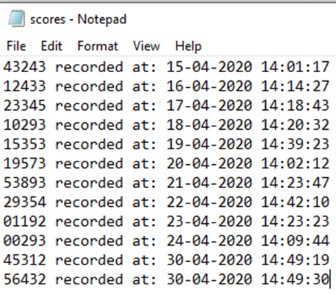
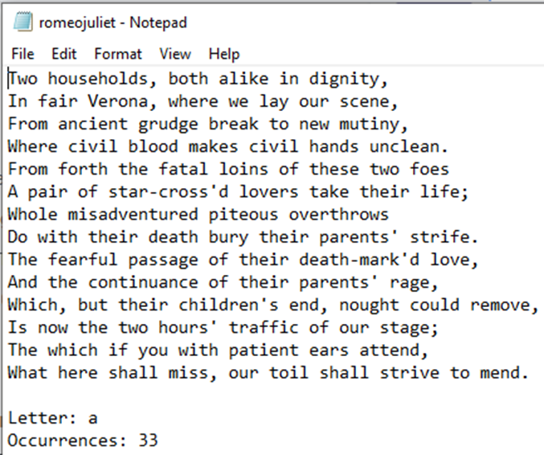

# Session 07: File Exercises Continued

These exercises are for you to use as practice.

Make mistakes, correct them and enjoy the success as you complete each one.

If you are stuck, then ask for assistance from your lecturer, or from the
lecturer who is holding a Workshop Lab.

## Text files and other assets

The text files and other assets (for example, images) are saved in an 
`assets` folder within this session's folder.

Sometimes files will be linked to from previous session folders to reduce 
duplication and errors from said duplication. 

## Useful Code Snippets

Appends to an existing file called players.txt and adds the player DragonShark on a new line

```python
file = open("players.txt","a")
file.write("\nDragonShark")
file.close()
```

Imports the datetime function, creates an identifier for the current time, creates a variable to hold the current time in the specified format

```python
import datetime
current_time = datetime.datetime.now()
timestamp = current_time.strftime("%d-%m-%Y %H:%M:%S")
```

## Filename: exercise-01.py

> This challenge is to append a timestamped score to an existing file.
>
> Before starting this challenge, make sure that you have the `scores.txt` file 
> which can be found here: 
> 
> [scores.txt](../Session-07/assets/scores.txt)

Use the code snippets above to create a program that performs the following:

- Prompts the user to enter their latest score
- Adds a new score entry to the end of the scores.txt file using the format 
  shown below:
- `10293 recorded at: 30-04-2020 14:49:57`


### Example input/output

```text
Enter your latest score:
10293
```


### Example text file data

A new entry should appear at the bottom of the file on a new line. 



Test your code and make sure it works as expected.


## Filename: exercise-02.py

> This challenge uses dictionaries and files to count letters in a text file.
>
> Before starting this challenge, make sure that you have the
> `romeo-juliet.txt` file which can be found here: 
>
> [romeo-juliet.txt](../Session-07/assets/romeo-juliet.txt)

Use the code snippets above to create a program that performs the following:

- Reads the contents of the `romeo-juliet.txt` file
- Searches for all occurrences of the lower case letter `a`
- Appends the text file with a message at the bottom in the following format:

```text
Letter: a 
Occurrences: 33
```

> **Tip:** You will need to read the file, then append the file in separate 
> steps.

Example text file data:



Test your code and check it works as expected.


## Filename: exercise-03.py

## Filename: exercise-04.py

## Filename: exercise-05.py

## Filename: exercise-06.py


# Acknowledgement

Some of these exercises are based on the resources from
[ncce.io/tcc](ncce.io/tcc). They are licensed under the Open Government
Licence, version 3. For more information on this licence,
see [ncce.io/ogl](ncce.io/ogl).

More exercises will be available in [Session-08](../Session-08).
